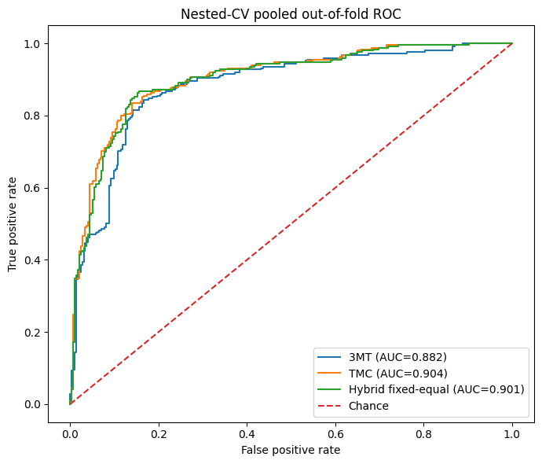
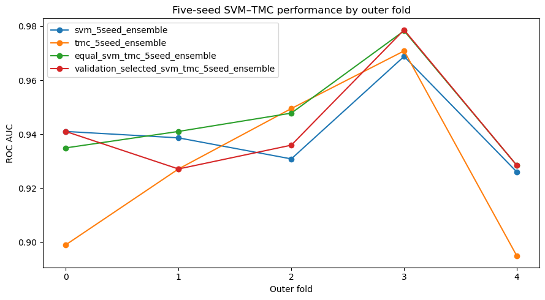

# Availability-aware multimodal learning for MCI prognosis

This repository contains the implementation of an MSc Artificial Intelligence project on 36-month progression from mild cognitive impairment (MCI) to Alzheimer's disease using multimodal ADNI data, together with follow-up experiments carried out after the dissertation.

The core model combines two pathways:

- a cross-modal interaction pathway that models dependencies between available modalities;
- a modality-specific evidential pathway that produces uncertainty-aware predictions and combines evidence across modalities.

Participants with incomplete multimodal records are retained. Availability masks represent missing modalities instead of imputing entire missing branches.

## 1. Repository structure

```text
01_data_preparation/
02_model_training/
03_evaluation_and_uncertainty/
04_temporal_sensitivity/
05_utilities/
06_extended_experiments/
results/
```

### 1.1 Data preparation

The data-preparation notebooks construct the clinical cohort, preprocess non-imaging modalities, prepare MRI inputs, align observations to baseline, create availability and feature masks, and write fold-specific model inputs.

Recommended order:

```text
00_Non_Imaging_Inventory_and_Coverage.ipynb
01_Demographics_Preprocessing.ipynb
02_MMSE_Preprocessing.ipynb
03_ADAS_Preprocessing.ipynb
04_FAQ_Preprocessing.ipynb
05_CSF_Biomarker_Preprocessing.ipynb
06_Plasma_Biomarker_Preprocessing.ipynb
07_APOE_Preprocessing.ipynb
08_Clinical_Cohort_and_Baseline_Alignment.ipynb
09_MRI_Cohort_and_Manifest_Preparation.ipynb
10_MRI_DICOM_Extraction_and_Inventory.ipynb
11_MRI_NIfTI_Preprocessing_and_QC.ipynb
12_MRI_MNI_N4_SyN_Preprocessing.ipynb
13_Multimodal_Input_Preparation.ipynb
```

### 1.2 Model training

```text
20_Fixed_Equal_Fusion_Training.ipynb
21_Learned_Participant_Fusion_Seed_Sensitivity.ipynb
22_Fixed_Equal_Fusion_Seed_Sensitivity.ipynb
```

The dissertation experiments use five outer folds and repeated random seeds.

### 1.3 Evaluation and uncertainty

```text
30_Fixed_Equal_Fusion_CV_Aggregation.ipynb
31_Learned_vs_Fixed_Fusion_Seed_Comparison.ipynb
32_Learned_Fusion_Seed_Consolidation.ipynb
33_Fixed_Fusion_Uncertainty_Attribution_Repeated_Seeds.ipynb
34_Learned_Fusion_Routing_and_Constant_Baseline.ipynb
```

These notebooks aggregate held-out predictions, compare fusion strategies, and analyse evidential uncertainty and modality conflict.

### 1.4 Temporal sensitivity

```text
40_Temporal_Sensitivity_Prerequisites_Audit.ipynb
41_Prebaseline_Fixed_Equal_Fusion_Training.ipynb
42_Prebaseline_Fixed_Equal_Fusion_CV_Aggregation.ipynb
43_Original_vs_Prebaseline_Paired_Comparison.ipynb
```

This analysis reconstructs a stricter pre-baseline input definition and compares it with the main fixed-fusion experiment.

### 1.5 Extended experiments

`06_extended_experiments/` contains the later model-selection and comparison work:

```text
model_selection/
architecture_sensitivity/
classical_baselines/
fusion/
uncertainty_and_error_analysis/
```

These experiments include nested model selection, small/medium/full architecture comparisons, five-seed classical baselines, seed-matched MRI embeddings, SVM–TMC/SVM–neural fusion, MC-dropout uncertainty and participant-level error-pattern analysis.

Earlier superseded notebooks are kept under `archive/` for provenance. Current notebooks live one level above the archive folders.

## 2. Selected follow-up results

The figures below come from the completed follow-up notebooks. They are separate from the original dissertation result tables.

### Nested-CV outer-test evaluation

The locked five-seed nested-CV evaluation produced pooled out-of-fold ROC AUCs of 0.882 for 3MT, 0.904 for TMC and 0.901 for fixed-equal hybrid fusion across 544 participants.



### Classical and SVM fusion experiments

The five-seed RBF-SVM baseline reached ROC AUC 0.940 in the pooled analysis. Equal SVM + TMC fusion reached 0.944, while validation-selected fusion weights did not improve on the simple equal-weight rule. The paired-bootstrap interval for the equal SVM + TMC improvement over SVM included zero, so the small numerical gain should not be treated as a clear performance difference.



Aggregate metrics and paired comparisons are available in `results/extended_experiments/`.

## 3. Data availability

This repository does not distribute ADNI data.

Authorised ADNI data and generated intermediate files must be stored separately. Raw participant tables, MRI volumes, checkpoints and participant-level predictions should not be committed to the repository.

Notebook outputs in the extended-experiment folder are intentionally cleared before publication. This removes participant identifiers, local filesystem paths and bulky execution logs while keeping the source code reproducible. Selected aggregate figures and tables are committed separately under `results/`.

## 4. Execution environment

The original notebooks were developed in Google Colab using Python and PyTorch with GPU acceleration. Later experiments also used QMUL JHub.

Install the Python dependencies with:

```bash
pip install -r requirements.txt
```

MRI preprocessing and model training are computationally expensive and are intended for GPU-backed execution.

## 5. Project root

The original Colab experiments used:

```python
PROJECT_ROOT = Path("/content/drive/MyDrive/adni_mri")
```

JHub experiments use paths under `/home/jovyan/`. Update the configuration cell in each notebook when running in a different environment.

## 6. Reproducing the dissertation experiments

The final task-ready fold inputs are created by:

```text
01_data_preparation/13_Multimodal_Input_Preparation.ipynb
```

Repeated fixed equal fusion:

```text
02_model_training/22_Fixed_Equal_Fusion_Seed_Sensitivity.ipynb
```

Repeated learned participant-specific fusion:

```text
02_model_training/21_Learned_Participant_Fusion_Seed_Sensitivity.ipynb
```

Matched repeated-seed comparison:

```text
03_evaluation_and_uncertainty/31_Learned_vs_Fixed_Fusion_Seed_Comparison.ipynb
```

Repeated-seed uncertainty attribution:

```text
03_evaluation_and_uncertainty/33_Fixed_Fusion_Uncertainty_Attribution_Repeated_Seeds.ipynb
```

## 7. Reproducing the follow-up experiments

The later experiments are grouped by purpose rather than by chronological notebook number. Start with `06_extended_experiments/README.md` for the directory map.

The current locked nested-CV evaluation is:

```text
06_extended_experiments/model_selection/final_nested_cv_evaluation.ipynb
```

The five-seed classical baseline comparison is:

```text
06_extended_experiments/classical_baselines/classical_baselines_5seeds.ipynb
```

The SVM–TMC fusion experiment is:

```text
06_extended_experiments/fusion/svm_tmc_5seed_fusion.ipynb
```

## 8. Outputs

Generated artefacts stay outside the repository unless they are aggregate, non-sensitive results. External outputs include prepared fold tables, MRI arrays, checkpoints, training histories and participant-level predictions.

The committed `results/` directory contains only aggregate metrics and selected figures.

## 9. Standalone executable

This project is a reproducible research pipeline rather than a standalone application. The notebooks document the execution order, configuration and outputs needed to reproduce the experiments.
